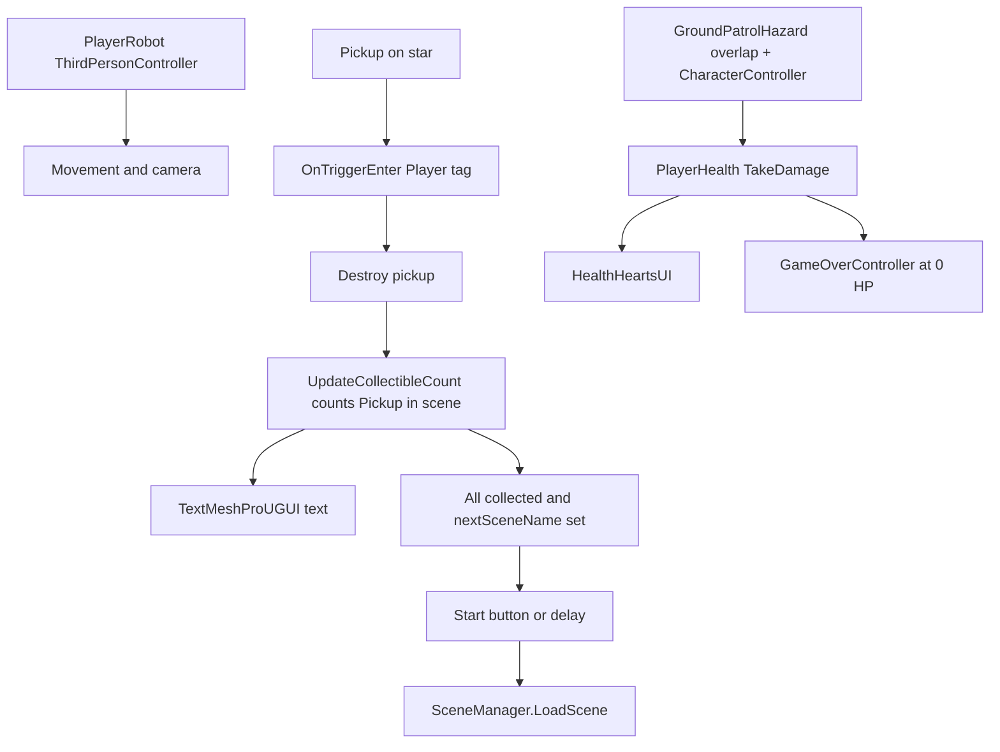

# Project architecture

This document describes how this Unity 3D project is structured, how gameplay pieces connect, and where to make common changes. It is written for human developers and for AI assistants working in the repo.

## Stack and rendering

| Area | Choice |
|------|--------|
| Render pipeline | **URP** (Universal Render Pipeline) — `com.unity.render-pipelines.universal` |
| Input | **Input System** package — `PlayerInput` on the character; actions wired in Project Settings. `StarterAssets.inputactions` includes keyboard/mouse plus gamepad fallbacks for **8Bitdo SN30 Pro** (`<Gamepad>` and `<Joystick>` paths for move/look/jump/sprint). |
| Camera | **Cinemachine** (v3 API: `Unity.Cinemachine` namespaces in project code) |
| UI | **uGUI** + **TextMeshPro** (collectible counter uses `TextMeshProUGUI`) |
| In-editor tutorials | **Unity Learn IET Framework** (`com.unity.learn.iet-framework`) under `Assets/Tutorials/` |

See `Packages/manifest.json` for exact package versions.

## Scenes and builds

- **Gameplay scenes:** `Assets/Scenes/Level1_Scene.unity` (entry / first level) and `Assets/Scenes/Level2_Scene.unity` (second level). Level 1 is the full tutorial-style layout. **Both** levels include a **`BadGuy_GroundPatrol`** prefab instance on the main **`Ground`** slab **toward +X (opposite the `PlayerRobot` spawn near −X)**; offset up so the character clears the floor. The prefab uses **2×** uniform root scale and **`GroundPatrolHazard.moveSpeed`** **1.25** (slower chase) with a slightly larger **`playerContactRadius`** than the prior 1.5× / speed-**2** tuning. Art sources live under **`Assets/SourceFiles/BadGuy/`** (Steel Sentinel character + merged animations `.glb` files, imported with **`com.unity.cloud.gltfast`**). After you run **`Tools → Bad Guy → Integrate Steel Sentinel into BadGuy_GroundPatrol`** once (see **Editor-only** below), the prefab replaces the placeholder capsule with that mesh and a simple **`Animator`** (walk clip). **`GroundPatrolHazard`** (default **`chasePlayer`**) follows the **`Player`** on XZ, faces the robot, syncs walk playback speed to movement, and aligns the **`SteelSentinel_Visual`** feet to the ground on the first frame; turn **`chasePlayer`** off to use only **`worldPatrolPoints`** / **`waypoints`** / **`patrolOffsetsFromSpawn`**. Contact removes one heart per hit (cooldown) via **`PlayerHealth.TakeDamage`**. **Level 2** is a compact platforming layout: **`Ground`**, **seven** thin **`L2_Platform_*`** cube steps (orange / light-blue materials) forming two routes—**left** toward `Collectible_Star_Easy` and **center** toward `Collectible_Star (1)`—plus runtime essentials (`PlayerRobot`, directional light, post-processing volume, `Remaining_Collectibles_UI`). Stars sit **above** the platforms so you must jump the cubes to collect them. Former tutorial props, extra stars under `Collectibles`, and audio/VFX prefabs remain in the scene file but are **inactive**. HUD: **`Remaining_Collectibles_UI`** prefab has **`HealthHeartsUI`** (three hearts) and **`GameOverController`** on the canvas root for **`PlayerHealth`** on the robot; void falls cost one heart per respawn by default (**`RespawnPlayer.healthLossOnFall`**). At **0 hearts**, a **game over** overlay pauses the game; **Enter** reloads the **current scene** so stars and hearts reset.
- **Build list:** Order in **File → Build Settings** (see `ProjectSettings/EditorBuildSettings.asset`): index **0** = `Level1_Scene`, index **1** = `Level2_Scene`.

**Level flow:** `UpdateCollectibleCount` on the UI text can set `nextSceneName` (scene asset name without `.unity`). By default **`requireButtonClickForNextScene`** is on: after all `Pickup` objects are collected, gameplay pauses (`Time.timeScale = 0`) until the player taps **Start** (a button is created at runtime under the canvas if none is assigned), then **`Level2_Scene`** loads. **Enter** / keypad **Enter** also confirm. Turn **`requireButtonClickForNextScene`** off to auto-advance after **`delayBeforeLoadSeconds`** instead. **Level 1** keeps **`bonusWaveSceneName`** empty so clearing stars goes straight to this win overlay (no intermediate “bonus stars” wave). Level 2 leaves `nextSceneName` empty so the success message stays on screen.

**Important:** Any new scene loaded via `SceneManager.LoadScene` must be added to Build Settings.

**Per-level visuals (Ground):** The **`Ground`** object uses [`Material_Checkerboard.mat`](../Assets/Materials/Material_Checkerboard.mat) in **Level 1** and [`Material_Circuits.mat`](../Assets/Materials/Material_Circuits.mat) in **Level 2**. [`GroundMaterialBySceneName.cs`](../Assets/SourceFiles/Scripts/GroundMaterialBySceneName.cs) on **`Ground`** applies the correct **`sharedMaterial`** from **`gameObject.scene.name`** (`Level1_Scene` / `Level2_Scene`)—the scene that **owns** this object, not `SceneManager.GetActiveScene()`—in **`Awake`** (and **`OnValidate`** in the Editor when not playing) so the two levels stay visually distinct even with multi-scene editing or a different active scene tab.

## High-level runtime flow

1. The player character is a **prefab instance** named **`PlayerRobot`** in the scene hierarchy. It uses **`StarterAssets.ThirdPersonController`** and requires the **`Player`** tag for collectible triggers.
2. Each collectible is a GameObject with a **`Pickup`** component. On trigger with **`Player`**, it may spawn a particle prefab, then **`Destroy(gameObject)`**.
3. **`UpdateCollectibleCount`** (on a UI object with **`TextMeshProUGUI`**) counts active **`Pickup`** components each frame until none remain, then shows a success message.
4. **`GroundPatrolHazard`** (e.g. on prefab **`BadGuy_GroundPatrol`**) uses a root **`CharacterController`** for movement so the enemy **does not pass through** static colliders. It by default **chases** the **`Player`** on the horizontal plane (**`chasePlayer`**); otherwise moves between patrol points—**`worldPatrolPoints`**, optional **`waypoints`** `Transform`s, or **`patrolOffsetsFromSpawn`** relative to **`Awake`** position. Before each horizontal step, **`preventFallingOffEdges`** (default **on**) raycasts downward at the planned XZ to block movement into open air or drops larger than **`maxStepDownForEdgeSafety`**. A **contact sphere** (**`playerContactRadius`** / **`playerContactOffsetLocal`**) detects **`Player`** overlap (replacing the old trigger capsule) and calls **`PlayerHealth.TakeDamage(1)`** respecting **`damageCooldown`**, then **pauses movement, animator speed, and further damage** for **`pauseAfterSuccessfulHitSeconds`** (default **2**). After that, **`damageCooldown`** applies again for the next hit.

There is **no** global game manager singleton in code today; behavior is scene-local on components.

## Directory map (project-owned)

| Path | Role |
|------|------|
| `Assets/Scenes/` | Scene assets (`.unity`) |
| `Assets/SourceFiles/Scripts/` | Core gameplay C# scripts (see table below) |
| `Assets/SourceFiles/BadGuy/` | Steel Sentinel `.glb` sources and generated **`BadGuy_Patrol.controller`** (after running the Bad Guy integrator menu) |
| `Assets/SourceFiles/InputSystem/` | Input-related helpers (e.g. `StarterAssetsInputs`) |
| `Assets/Editor/` | Editor utilities (e.g. **`BadGuyIntegrator`**); not included in player builds |
| `Assets/Tutorials/` | IET tutorial content, themes, and **editor** callbacks |
| `ProjectSettings/` | Unity project configuration (includes Input System asset reference) |
| `Packages/manifest.json` | Package dependencies (includes **`com.unity.cloud.gltfast`** for `.glb` / `.gltf` import) |

Third-party and generated content under `Assets/` (prefabs, models, audio, etc.) is not fully enumerated here; search the Project window by type or name when extending.

## Gameplay scripts (`Assets/SourceFiles/Scripts/`)

| Script | Responsibility |
|--------|----------------|
| `Pickup` | Rotates/bobs the star; on trigger with **`Player`**, plays optional VFX and destroys the object. |
| `GroundPatrolHazard` | Hazard: root **`CharacterController.Move`** for locomotion (collides with environment). Default **`chasePlayer`** follows **`Player`** on XZ and rotates to face; optional **`chaseFacingYawOffset`**. Otherwise patrols looped targets (`worldPatrolPoints`, **`waypoints`**, or **`patrolOffsetsFromSpawn`**). **`preventFallingOffEdges`** (default **on**) plus **`edgeSafetyGroundMask`**, **`edgeProbeStartAboveFeet`**, **`maxStepDownForEdgeSafety`** block only open air or large vertical drops (not obstacle tops vs. feet—walls use **`CharacterController`** collision). Ground raycast snap (**`snapFeetToGroundOnStart`**); optional **`visualChildName`** scopes ray-start height to that child’s renderers (default **`SteelSentinel_Visual`** on the integrator prefab). **`walkClip`**: if set (by **Tools → Bad Guy** integrator), a **PlayableGraph** plays the walk **`AnimationClip`** on the child **`Animator`** and clears the controller so walking works even when **`BadGuy_Patrol.controller`** has no motion; **`syncWalkAnimatorSpeed`** adjusts playable speed. **`Physics.OverlapSphereNonAlloc`** at **`playerContactOffsetLocal`** / **`playerContactRadius`** for **`Player`**: **`TakeDamage`**, **`damageCooldown`**, **`pauseAfterSuccessfulHitSeconds`**. Optional **`PlayerHealth`**; **`Player`** tag. |
| `RobotDamageHitFlash` | On **`Robot`** child of **`PlayerRobot`**: caches renderer **`_BaseColor`** / **`_Color`**; **`PlayHitFlash`** briefly tints materials toward **`flashTint`** (URP **`MaterialPropertyBlock`**). |
| `TmpDefaultFont` | Static helper for runtime **`TextMeshProUGUI`**: **`AssignIfEmpty`** sets **`font`** from **`TMP_Settings.defaultFontAsset`** or **`Resources.Load`** (`Fonts & Materials/LiberationSans SDF`). **`LiberationSansSafe`** replaces glyphs missing from that font (⌨, ★, ☆, ✨ / ✨+VS) so TMP does not log missing-character warnings. |
| `UpdateCollectibleCount` | UI: counts remaining **`Pickup`** instances; when all collected, shows success text and either waits for **Start** (`requireButtonClickForNextScene`, default **on**—creates a **`Button`** under the **`Canvas`** if **`nextLevelStartButton`** is unset) or auto-loads **`nextSceneName`** after **`delayBeforeLoadSeconds`**. **Enter** / keypad **Enter** also confirm. Pauses with **`Time.timeScale = 0`** until then; restores scale before load. **`TextMeshProUGUI.raycastTarget`** is off so clicks reach the button. Celebrations expand the **Background** panel, tint it, add temporary **chrome** (rim + accent strips), **TMP** outline/glow, spacing, and a light **scale / wobble** loop (unscaled time). Optional **bonus wave** (`bonusWaveSceneName` + **`bonusPickupPrefab`**) requires **`bonusPickupPrefab`** to be a **GameObject** prefab (the star pickup), not another asset type. Uses **`[DefaultExecutionOrder(-1000)]`** so **`LiberationSansSafe`** runs before **`TextMeshProUGUI`** on the same object; **`Awake`** / **`OnEnable`** / **`OnValidate`** (Editor) sanitize **`successMessage`**, **`bonusWaveCelebrationMessage`**, and current TMP text. |
| `PlayerHealth` | On **`PlayerRobot`**: max health 3, **`TakeDamage`** / **`HealToFull`**, **`OnHealthChanged`**, **`OnDepleted`** (C# event), optional **`onHealthDepleted`** (UnityEvent) when health reaches 0. |
| `HealthHeartsUI` | On **`Remaining_Collectibles_UI`** canvas root: three TMP heart glyphs (♥) created at runtime; full vs dim color from current health. Finds **`Player`** / **`PlayerHealth`** at runtime if unassigned. |
| `GameOverController` | On **`Remaining_Collectibles_UI`** canvas root: on **`OnDepleted`**, shows a modal (**`Time.timeScale = 0`**, disables **`PlayerInput`**), **Enter** reloads the active scene via **`SceneManager`** (respawns all **`Pickup`**s and full health). |
| `EnsurePlayerActiveOnStart` | On the UI canvas root: ensures **`Player`** is active and re-enables **`PlayerInput`**, **`CharacterController`**, and **`ThirdPersonController`** if they were disabled. Runs early (**executionOrder -50**). |
| `GroundMaterialBySceneName` | On **`Ground`**: assigns Checkerboard vs Circuits from serialized references using **`gameObject.scene.name`** (with **`IsValid()`** guard). |
| `ThirdPersonController` | Starter Assets third-person movement, jump, grounded checks, Cinemachine camera target (`StarterAssets` namespace). |
| `RespawnPlayer` | If the character falls below a Y threshold, resets position/rotation and aligns Cinemachine (`StarterAssets` namespace). Optional **`PlayerHealth`**: **`healthLossOnFall`** (default **1**) calls **`TakeDamage`** on each void respawn. Skips move/SFX if already at **0** HP before damage (avoids spam while game over is showing). |
| `MotionAudioController` | Movement-driven audio (fade) tied to an **`Animator`** in parent hierarchy. |

## Editor-only and tutorial code

- **`Assets/Editor/BadGuyIntegrator.cs`** — **Tools → Bad Guy → Integrate Steel Sentinel into BadGuy_GroundPatrol** reimports the two Steel Sentinel `.glb` files, forces **glTFast** **Animation → Mecanim**, removes the placeholder capsule mesh, parents **`SteelSentinel_Visual`**, scales toward ~2 m, assigns walk clip to **`BadGuy_Patrol.controller`**, assigns the character **`Avatar`** on the **`Animator`** (required for the mesh to animate), sets **Always Animate** culling, and ensures a root **`CharacterController`** (removes any legacy trigger **`CapsuleCollider`**). **Tools → Bad Guy → Repair animator controller + avatar** refreshes **`BadGuy_Patrol.controller`** clip wiring, **`Animator`** controller, **Avatar**, culling, and **`CharacterController`** sizing on the existing prefab (use if walk does not play or the controller state has no motion). **Does not run in player builds.**

- **`Assets/Tutorials/Settings/Editor/TutorialCallbacks.cs`** — `ScriptableObject` with menu **Create → Tutorials → TutorialCallbacks Instance**. Uses **`UnityEditor`** APIs; **does not run in player builds**. It can find/disable objects by name, frame objects by tag, etc. If tutorial steps reference scene object names, renaming those objects may require updating tutorial assets under `Assets/Tutorials/`.

## Conventions and constraints

- **Collectibles:** Must have **`Pickup`** on the active GameObject so `FindObjectsByType(typeof(Pickup), …)` and the counter stay correct.
- **Player identification:** **`Pickup`** uses `other.CompareTag("Player")`. The robot root must keep the **`Player`** tag.
- **Controller support:** `Assets/SourceFiles/InputSystem/StarterAssets.inputactions` is the source of truth for player controls. For **8Bitdo SN30 Pro**, run it in controller mode that exposes standard gamepad input (XInput/Switch mode depending OS), then map in-game through the existing `Player` action map bindings.
- **Namespaces:** `StarterAssets` is used for character and respawn scripts; global-namespace scripts include `Pickup`, `GroundPatrolHazard`, `TmpDefaultFont`, `UpdateCollectibleCount`, `PlayerHealth`, `HealthHeartsUI`, `GameOverController`, `MotionAudioController`.

## Common tasks (where to edit)

| Goal | Where to look |
|------|----------------|
| Change star behavior or VFX | `Pickup.cs` |
| Change win message or add scene transition after all stars | `UpdateCollectibleCount.cs` + Build Settings + `SceneManager` |
| Tune movement / camera | `ThirdPersonController.cs`, Cinemachine assets in scene |
| Fall / void respawn | `RespawnPlayer.cs` on the player |
| Hearts / damage / heal | `PlayerHealth.cs`, `HealthHeartsUI.cs`; optional **`onHealthDepleted`** / **`OnDepleted`** on `PlayerHealth`; patrol hazard damage in `GroundPatrolHazard.cs` / prefab **`BadGuy_GroundPatrol`** |
| Bad Guy Steel Sentinel mesh / animations | GLBs in **`Assets/SourceFiles/BadGuy/`**; **`Tools → Bad Guy → Integrate Steel Sentinel into BadGuy_GroundPatrol`** (`BadGuyIntegrator.cs`); **`com.unity.cloud.gltfast`** in **`Packages/manifest.json`** |
| Game over / retry level | `GameOverController.cs` (Enter = reload active scene) |
| Use moving platform variants | `Assets/Prefabs/Moving_Platform.prefab` (vertical) and `Assets/Prefabs/Moving_Platform_Horizontal.prefab` (horizontal), driven by animation assets in `Assets/SourceFiles/Animation/` |
| New level as a new scene | Duplicate scene under `Assets/Scenes/`, add to Build Settings, load by name or build index |
| Different ground (or other mesh) look per level | Set **Mesh Renderer → Materials** on that object **in each scene** (duplicated scenes still share material *assets* until you assign different ones per scene). |

## Documentation policy

Keep this file accurate whenever you change how the project works or where edits should happen. Prefer updating docs **in the same change** as code or scene edits (same PR / commit when possible).

- Changes that affect **runtime behavior**, **scene order / loading**, or **where to configure something** belong in **Scenes and builds**, **Gameplay scripts**, **Common tasks**, or a short new bullet—not only in commit messages.
- **Unity-only edits** (scenes, prefabs, materials) with **no C# diff** still need doc updates when they change **structure** users care about (e.g. per-level materials, new scenes in the build, renamed entry scene). Layout-only tweaks that do not affect flow can skip docs.

### Checklist — update `ARCHITECTURE.md` when you…

- Add, rename, or remove scenes, or change **Build Settings** order — update **Scenes and builds** and confirm [`ProjectSettings/EditorBuildSettings.asset`](../ProjectSettings/EditorBuildSettings.asset).
- Change level flow (`UpdateCollectibleCount`, `nextSceneName`, delays, new managers).
- Add, remove, or rename scripts under `Assets/SourceFiles/Scripts/` — update the **Gameplay scripts** table.
- Change important **prefabs**, **tags**, **layers**, or **Input** setup in a way that affects how others wire the game.
- Change **tutorial** or editor-only steps that reference scene or object names under `Assets/Tutorials/`.
- Introduce **per-level differences** worth knowing (entry scene, materials on shared-named objects like `Ground`, different UI wiring).

Also update [`README.md`](../README.md) if **how to open the project** or **first scene to load** changes.
